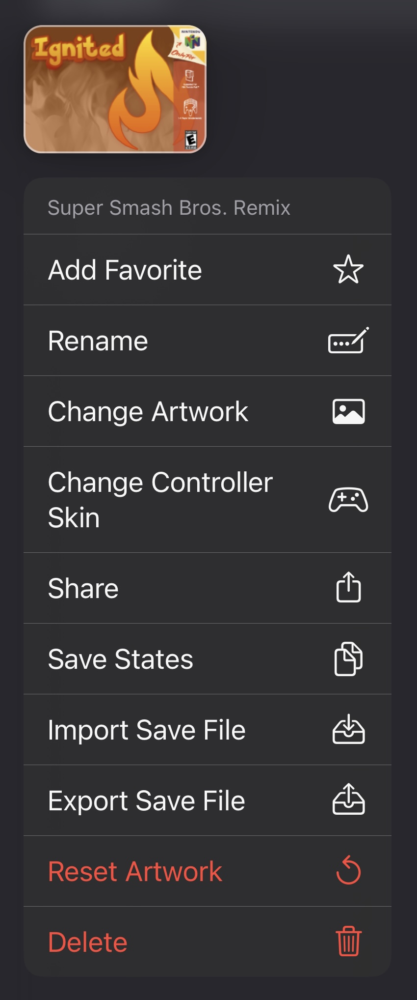

# 📄 Context Menu

The context menu is accessed by tapping and holding on a game in your library, and has many options for managing your games.

<figure><figcaption>
Context Menu
</figcaption></figure>

## <mark style="color:orange;">Add/Remove Favorite</mark>

Adds or removes the game from your favorites. Favorite games appear at the top of your games list with a distinct yellow glow to make them easier to find.

## <mark style="color:orange;">Rename</mark>

Changes the title of the game.

## <mark style="color:orange;">Change Artwork</mark>

Changes the artwork for the game. Selecting this item will open a new menu to select the source of the artwork image. Animated `.gif` images are partially supported.

### <mark style="color:yellow;">Clipboard</mark>

This option uses an image from the clipboard if you have one copied. To use this option, first search online for an artwork image and copy it.

### <mark style="color:yellow;">Photo Library</mark>

This option uses an image from your Photos Library. You must give Ignited access to some or all of your photos to use this option. Ignited will only use photos for this purpose, and they won't be accessed/uploaded otherwise.

### <mark style="color:yellow;">Games Database</mark>

This option allows you to search the included game artwork database and use any image found there. Not all games are listed, romhacks aren't supported, and NES and N64 links currently don't work.

### <mark style="color:yellow;">Files</mark>

This option uses an image from your files. You will be prompted to select an image using the Files app.

## <mark style="color:orange;">Change Controller Skin</mark>

Changes the prefferred controller skin for the game. This skin will override the prefferred skin for this game's system.

## <mark style="color:orange;">Share</mark>

Shares the game's ROM file. Allows you to easily share and play your games with friends.

## <mark style="color:orange;">Save States</mark>

Opens a page to view all the save states for the game. From there you can manage your states, or tap on one to instantly load the game into that state.

## <mark style="color:orange;">Import Save File</mark>

Imports a save file into the game. Save files can be different types within the same system, and different emulators using the same type may still produce incompatible save files. You should expect possible errors during this process, which are not specifically handled by Ignited. There are save file converters in [settings](../settings/) that may solve the issues.

## <mark style="color:orange;">Export Save File</mark>

Exports the game's save file. If this save file is modified by another emulator or program, it may no longer be compatible with Ignited and the [#import-save-file](context-menu.md#import-save-file "mention") option may fail.

## <mark style="color:orange;">Reset Artwork</mark>

Resets the game's artwork to the one it had when it was imported.

## <mark style="color:orange;">Delete</mark>

Permanently removes the game and all its saves, states, artwork and cheats. Use this option with extreme caution! Files will also be removed from your [Ignited Sync](../settings/ignited-sync.md) backup and cannot be recovered.
